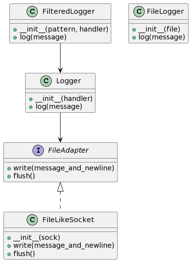
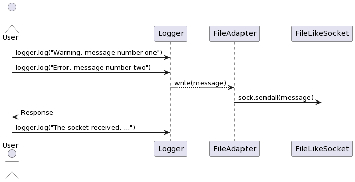
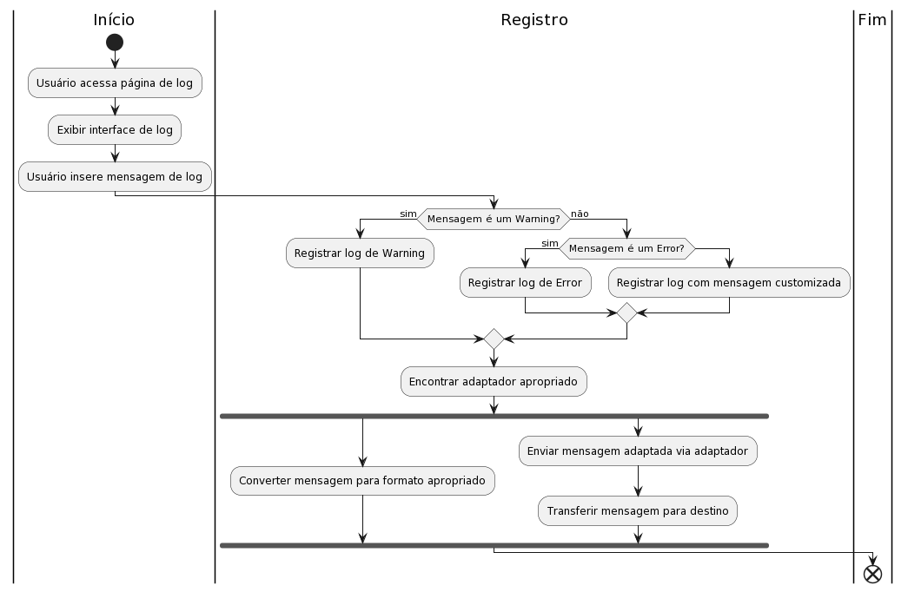

# Solução nº 1: Adapter Pattern

### Problema a ser Resolvido:

Imagine que você tem um sistema de logging em um aplicativo e deseja suportar diferentes tipos de saída, como exibir mensagens em um arquivo, em um socket ou em syslog. No entanto, essas saídas têm interfaces diferentes. Como você pode lidar com essas diferentes interfaces sem precisar criar muitas subclasses específicas para cada combinação?

### Estratégia Adotada:

O Adapter Pattern permite que você envolva uma classe com uma interface incompatível e forneça uma nova interface que seja compatível com o código existente. Neste caso, vamos adaptar diferentes tipos de saída (como sockets) para se comportarem como um arquivo, de modo que possam ser usados pelo logger existente.

### Diagrama de classes

```
@startuml
class Logger {
    +__init__(handler)
    +log(message)
}

class FileLogger {
    +__init__(file)
    +log(message)
}

class FilteredLogger {
    +__init__(pattern, handler)
    +log(message)
}

interface FileAdapter {
    +write(message_and_newline)
    +flush()
}

class FileLikeSocket {
    +__init__(sock)
    +write(message_and_newline)
    +flush()
}

Logger --> FileAdapter
FilteredLogger --> Logger
FileAdapter <|.. FileLikeSocket
@enduml

```



### Diagrama de Sequencia

```
@startuml
actor User

User -> Logger: logger.log("Warning: message number one")
User -> Logger: logger.log("Error: message number two")

Logger --> FileAdapter: write(message)
FileAdapter -> FileLikeSocket: sock.sendall(message)
FileLikeSocket --> User: Response

User -> Logger: logger.log("The socket received: ...")

@enduml

```



### Diagrama de Atividades

```
@startuml
|Início|
start
:Usuário acessa página de log;
:Exibir interface de log;
:Usuário insere mensagem de log;
|Registro|
if (Mensagem é um Warning?) then (sim)
  :Registrar log de Warning;
else (não)
  if (Mensagem é um Error?) then (sim)
    :Registrar log de Error;
  else
    :Registrar log com mensagem customizada;
  endif
endif
:Encontrar adaptador apropriado;
fork
  :Converter mensagem para formato apropriado;
fork again
  :Enviar mensagem adaptada via adaptador;
  :Transferir mensagem para destino;
end fork
|Fim|
end
@enduml


```



### Código Adaptado e Comentado

```python {.line-numbers}
import socket
import sys

class FileAdapter:
    """Interface de adaptador para se comportar como um arquivo."""
    def write(self, message_and_newline):
        pass

    def flush(self):
        pass

class FileLikeSocket(FileAdapter):
    """Adaptador para socket, comportando-se como um arquivo."""
    def __init__(self, sock):
        self.sock = sock

    def write(self, message_and_newline):
        self.sock.sendall(message_and_newline.encode('ascii'))

    def flush(self):
        pass

class Logger(object):
    """Classe base do logger."""
    def __init__(self, file):
        self.file = file

    def log(self, message):
        """Registra uma mensagem."""
        self.file.write(message + '\n')
        self.file.flush()

class FilteredLogger(Logger):
    """Logger filtrado que herda da classe base Logger."""
    def __init__(self, pattern, file):
        self.pattern = pattern
        super().__init__(file)

    def log(self, message):
        """Registra uma mensagem somente se o padrão estiver presente."""
        if self.pattern in message:
            super().log(message)

def main():
    sock1, sock2 = socket.socketpair()

    fs = FileLikeSocket(sock1)
    logger = FilteredLogger('Error', fs)
    logger.log('Warning: message number one')
    logger.log('Error: message number two')

    print('The socket received: %r' % sock2.recv(512))

if __name__ == '__main__':
    main()


```

### Como testar?

Neste exemplo, você pode fazer os seguintes testes:

1. Modifique as mensagens no `logger.log` para diferentes tipos de mensagens (exemplo: "Info: mensagem normal").
2. Modifique o padrão no `FilteredLogger` para algo diferente ("Warning" ou "Info").
3. Crie um novo adaptador para um tipo diferente de saída, como syslog.
4. Execute o código e observe a saída no console e no socket simulado.
