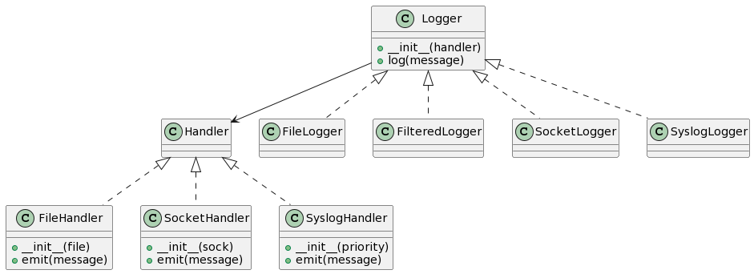
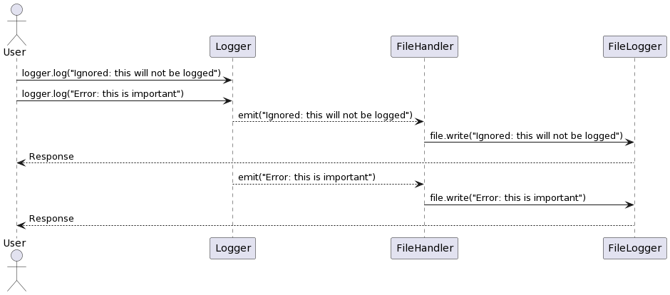
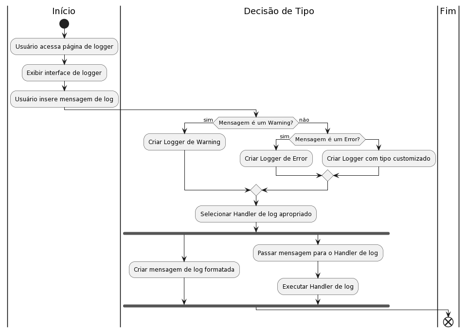

# Solução nº 2: Bridge Pattern

### Problema a ser Resolvido:

No problema original, você tem uma classe `Logger` que lida com mensagens de log e precisa suportar diferentes tipos de saída (arquivos, sockets, syslog). No entanto, você não quer criar muitas subclasses específicas para cada combinação de logger e saída. Como você pode separar a lógica da saída da lógica do logger e permitir diferentes combinações?

### Estratégia Adotada:

O Bridge Pattern divide a abstração do logger da implementação da saída. Em vez de estender subclasses específicas para cada combinação, você cria duas hierarquias de classes separadas - uma para a abstração do logger e outra para a implementação da saída. Isso permite que você combine diferentes loggers e manipuladores em tempo de execução.

### Diagrama PlantUML

```
@startuml
class Logger {
    +__init__(handler)
    +log(message)
}

class FileHandler {
    +__init__(file)
    +emit(message)
}

class SocketHandler {
    +__init__(sock)
    +emit(message)
}

class SyslogHandler {
    +__init__(priority)
    +emit(message)
}

Logger --> Handler

Logger <|.. FileLogger
Logger <|.. FilteredLogger
Logger <|.. SocketLogger
Logger <|.. SyslogLogger

Handler <|.. FileHandler
Handler <|.. SocketHandler
Handler <|.. SyslogHandler
@enduml

```



### Diagrama de Sequencia

```
@startuml
actor User

User -> Logger: logger.log("Ignored: this will not be logged")
User -> Logger: logger.log("Error: this is important")

Logger --> FileHandler: emit("Ignored: this will not be logged")
FileHandler -> FileLogger: file.write("Ignored: this will not be logged")
FileLogger --> User: Response

Logger --> FileHandler: emit("Error: this is important")
FileHandler -> FileLogger: file.write("Error: this is important")
FileLogger --> User: Response

@enduml

```



### Diagrama de Atividades

```
@startuml
|Início|
start
:Usuário acessa página de logger;
:Exibir interface de logger;
:Usuário insere mensagem de log;
|Decisão de Tipo|
if (Mensagem é um Warning?) then (sim)
  :Criar Logger de Warning;
else (não)
  if (Mensagem é um Error?) then (sim)
    :Criar Logger de Error;
  else
    :Criar Logger com tipo customizado;
  endif
endif
:Selecionar Handler de log apropriado;
fork
  :Criar mensagem de log formatada;
fork again
  :Passar mensagem para o Handler de log;
  :Executar Handler de log;
end fork
|Fim|
end
@enduml


```



### Código Adaptado e Comentado

```python {.line-numbers}
import sys
import syslog
import socket

class Logger(object):
    """Classe base do logger."""
    def __init__(self, handler):
        self.handler = handler

    def log(self, message):
        """Registra uma mensagem."""
        self.handler.emit(message)

class FileHandler:
    """Implementação da saída de arquivo."""
    def __init__(self, file):
        self.file = file

    def emit(self, message):
        """Emite uma mensagem para o arquivo."""
        self.file.write(message + '\n')
        self.file.flush()

class SocketHandler:
    """Implementação da saída de socket."""
    def __init__(self, sock):
        self.sock = sock

    def emit(self, message):
        """Emite uma mensagem para o socket."""
        self.sock.sendall((message + '\n').encode('ascii'))

class SyslogHandler:
    """Implementação da saída de syslog."""
    def __init__(self, priority):
        self.priority = priority

    def emit(self, message):
        """Emite uma mensagem para o syslog."""
        syslog.syslog(self.priority, message)

class FileLogger(Logger):
    """Logger que usa a implementação de saída de arquivo."""
    def __init__(self, file):
        handler = FileHandler(file)
        super().__init__(handler)

class FilteredLogger(Logger):
    """Logger filtrado que herda da classe base Logger."""
    def __init__(self, pattern, handler):
        self.pattern = pattern
        super().__init__(handler)

    def log(self, message):
        """Registra uma mensagem somente se o padrão estiver presente."""
        if self.pattern in message:
            super().log(message)

class SocketLogger(Logger):
    """Logger que usa a implementação de saída de socket."""
    def __init__(self, sock):
        handler = SocketHandler(sock)
        super().__init__(handler)

class SyslogLogger(Logger):
    """Logger que usa a implementação de saída de syslog."""
    def __init__(self, priority):
        handler = SyslogHandler(priority)
        super().__init__(handler)

def main():
    handler = FileHandler(sys.stdout)
    logger = FilteredLogger('Error', handler)

    logger.log('Ignored: this will not be logged')
    logger.log('Error: this is important')

if __name__ == '__main__':
    main()

```

### Como testar?

Neste exemplo, você pode fazer os seguintes testes:

1. Altere o tipo de saída do `FileHandler`, `SocketHandler` ou `SyslogHandler` para observar como a saída é redirecionada.
2. Modifique as mensagens no `logger.log` para diferentes tipos de mensagens (exemplo: "Info: mensagem normal").
3. Crie diferentes tipos de loggers combinando diferentes manipuladores.
4. Execute o código e observe a saída no console ou na saída correspondente.
