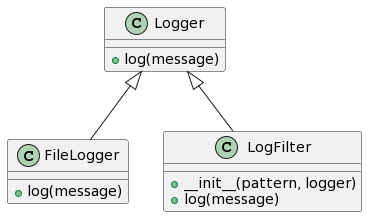
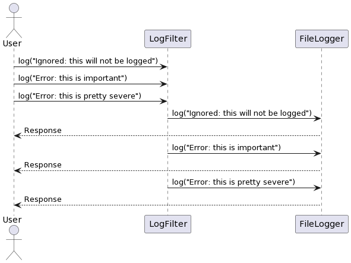
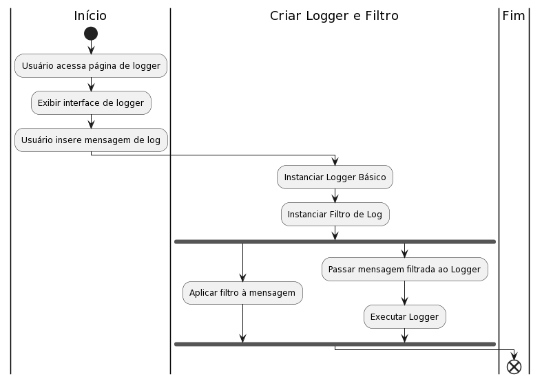

# Solução nº 3: Decorator Pattern

### Problema a ser Resolvido:

No problema original, você tem um logger básico que lida com mensagens de log. No entanto, você deseja adicionar diferentes comportamentos às mensagens, como filtrar mensagens com base em um padrão. Como você pode adicionar esses comportamentos sem criar subclasses para cada combinação?

### Estratégia Adotada:

O Decorator Pattern permite que você adicione comportamentos extras a um objeto existente de forma flexível. No nosso caso, vamos criar filtros decoradores que envolvem o logger e adicionam filtragem às mensagens antes de serem registradas.

### Diagrama de Classes

```
@startuml
class Logger {
    +log(message)
}

class FileLogger {
    +log(message)
}

class LogFilter {
    +__init__(pattern, logger)
    +log(message)
}

Logger <|-- FileLogger
Logger <|-- LogFilter
@enduml


```



### Diagrama de Sequencia

```
@startuml
actor User

User -> LogFilter: log("Ignored: this will not be logged")
User -> LogFilter: log("Error: this is important")
User -> LogFilter: log("Error: this is pretty severe")

LogFilter -> FileLogger: log("Ignored: this will not be logged")
FileLogger --> User: Response

LogFilter -> FileLogger: log("Error: this is important")
FileLogger --> User: Response

LogFilter -> FileLogger: log("Error: this is pretty severe")
FileLogger --> User: Response

@enduml

```



### Diagrama de Atividades

```
@startuml
start
:Create a FileLogger;
:Create a LogFilter;
:Create another LogFilter;
User -> LogFilter: log("Ignored: this will not be logged")
LogFilter -> FileLogger: log("Ignored: this will not be logged")
FileLogger --> User: Response

User -> LogFilter: log("Error: this is important")
LogFilter -> FileLogger: log("Error: this is important")
FileLogger --> User: Response

User -> LogFilter: log("Error: this is pretty severe")
LogFilter -> FileLogger: log("Error: this is pretty severe")
FileLogger --> User: Response

stop
@enduml

```



### Código Adaptado e Comentado

```python {.line-numbers}
import sys
import syslog
import socket

class Logger(object):
    """Classe base do logger."""
    def log(self, message):
        pass

class FileLogger(Logger):
    """Implementação da saída de arquivo."""
    def __init__(self, file):
        self.file = file

    def log(self, message):
        """Registra uma mensagem em um arquivo."""
        self.file.write(message + '\n')
        self.file.flush()

class LogFilter(Logger):
    """Filtro de logger que herda da classe base Logger."""
    def __init__(self, pattern, logger):
        self.pattern = pattern
        self.logger = logger

    def log(self, message):
        """Registra uma mensagem somente se o padrão estiver presente."""
        if self.pattern in message:
            self.logger.log(message)

def main():
    log1 = FileLogger(sys.stdout)
    log2 = LogFilter('Error', log1)

    log1.log('Noisy: this logger always produces output')

    log2.log('Ignored: this will be filtered out')
    log2.log('Error: this is important and gets printed')

    log3 = LogFilter('severe', log2)

    log3.log('Error: this is bad, but not that bad')
    log3.log('Error: this is pretty severe')

if __name__ == '__main__':
    main()

```

### Como testar?

Neste exemplo, você pode fazer os seguintes testes:

1. Modifique o padrão no `LogFilter` para filtrar mensagens com base em diferentes critérios (por exemplo, "Info" ou "Warning").
2. Altere as mensagens no `log1.log` para observar como as mensagens são registradas.
3. Combine diferentes filtros, como empilhar um filtro em cima do outro, e observe o resultado.
4. Execute o código e observe a saída no console.
